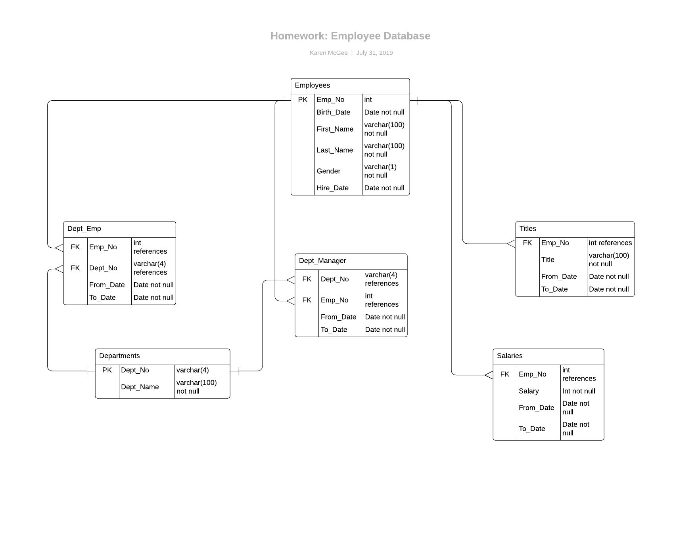

# Employee Database: A Mystery in Two Parts

## Background

It this scenario as a new data engineer at a large technology company, my first major task was a research project on employees of the corporation from the 1980s and 1990s. All that remained of the database of employees from that period were six CSV files.

Using this data, I designed the tables to hold data from the CSVs, imported the CSVs into a SQL database, and answered questions about the data. In other words, I performed:

1. Data Modeling

2. Data Engineering

3. Data Analysis

#### Data Modeling

First, I inspected the CSVs and sketched out an ERD of the tables. 

#### Data Engineering

* Using the information I had, I created a table schema for each of the six CSV files, specifying data types, primary keys, foreign keys, and other constraints.

* I imported each CSV file into the corresponding SQL table.

#### Data Analysis

Using the SQL table, I created the following lists to analyze this segment of employees:

1. Details of each employee: employee number, last name, first name, gender, and salary.

2. Employees who were hired in 1986.

3. Manager of each department with the following information: department number, department name, the manager's employee number, last name, first name, and start and end employment dates.

4. Department of each employee with the following information: employee number, last name, first name, and department name.

5. All employees whose first name is "Hercules" and last names begin with "B."

6. All employees in the Sales department, including their employee number, last name, first name, and department name.

7. All employees in the Sales and Development departments, including their employee number, last name, first name, and department name.

8. In descending order, the frequency count of employee last names.
